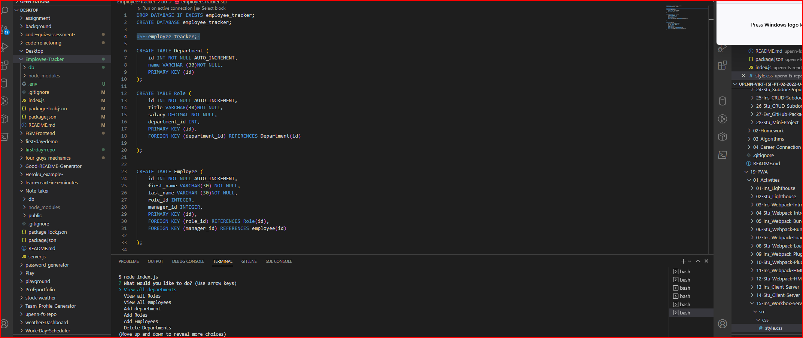

# Employee-Tracker

Creates a table for employer to track their employees. You are able to view employees title, salary and manager. You are also able to add a new employee to the list. You can update an Employees Role as well

# Table of Contents

Installation
Usage
Test
Questions
Links
Installations
You would need to install inquirer, console.tables and mysql

# Usage

App makes it easier for employer to track and edit employees

# Test

node, mysql

# Questions

# Links and Screen shots: https://youtu.be/SHOZMsFqQYE

